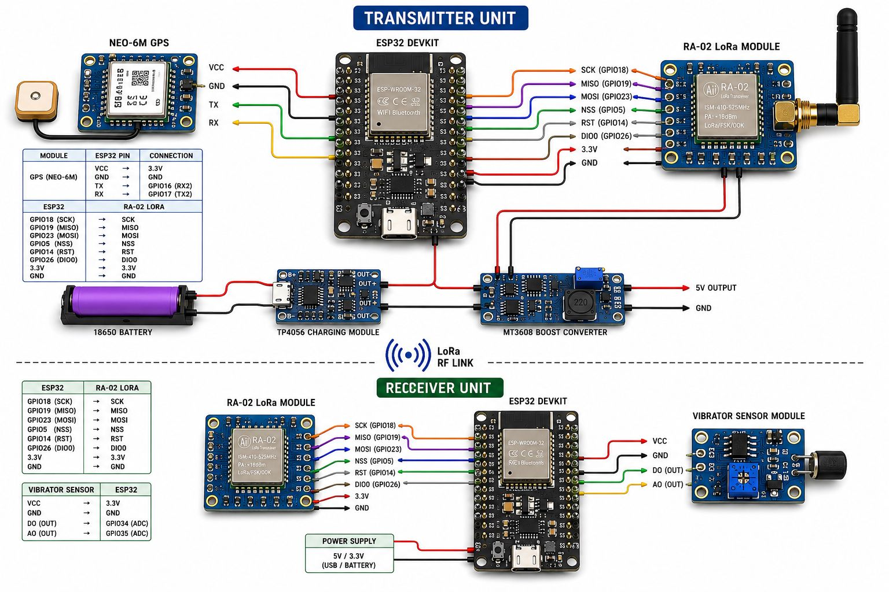
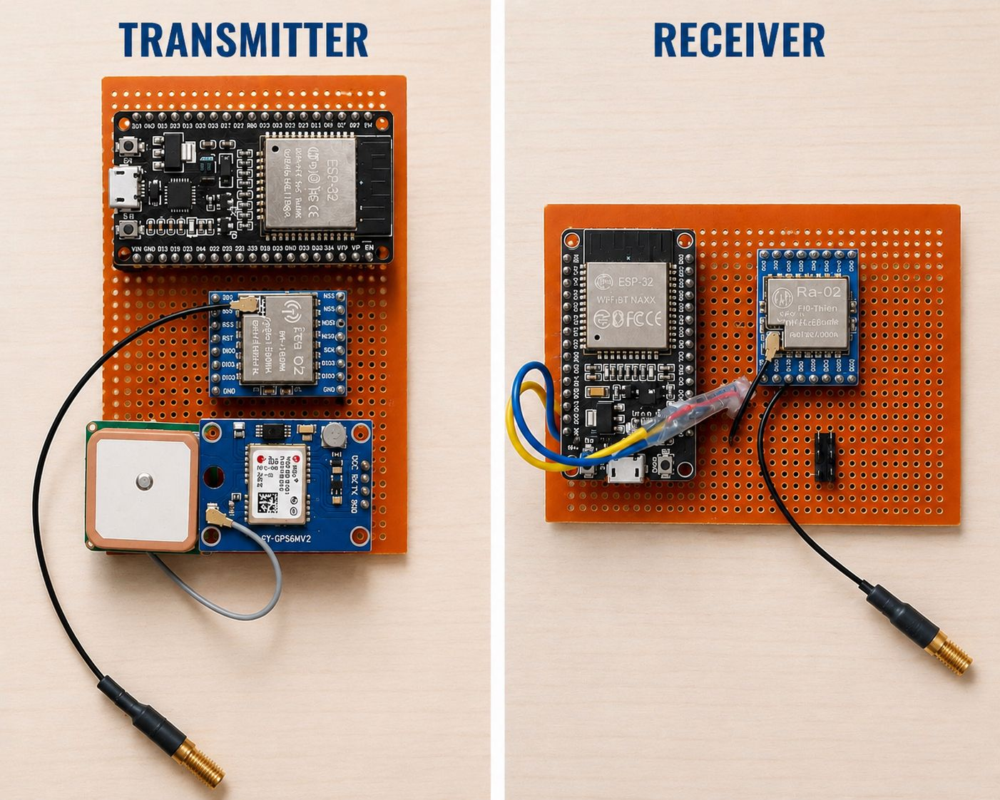
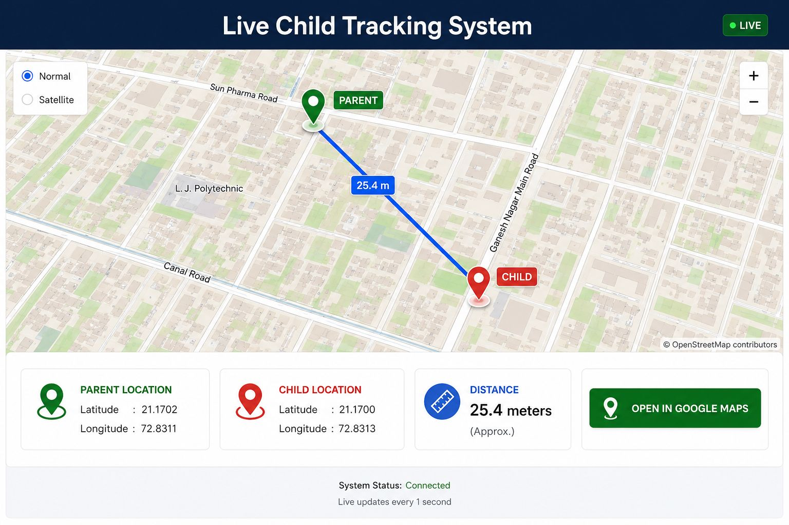

# 🛡️ Smart Child Monitoring System

<p align="center">
  
  
  
  
  
</p>

> An IoT-based real-time child safety monitoring system using ESP32, NEO-6M GPS, and LoRa wireless communication — no SIM card or internet required.

---

## 📌 Overview

The **Smart Child Monitoring System** is an embedded IoT solution designed to enhance child safety in public spaces. It tracks a child's live GPS location and wirelessly transmits the data over LoRa to a parent-side receiver. A safety alert is triggered whenever the child moves beyond a defined boundary, calculated using the **Haversine algorithm**.

The entire system operates without GSM, SIM, or internet connectivity — making it lightweight, low-cost, and interference-resistant.

---

## ✨ Features

- 📍 **Real-Time GPS Tracking** — Live latitude & longitude monitoring via NEO-6M GPS module
- 📡 **LoRa Wireless Communication** — 50-meter range wireless data transfer without SIM or internet
- 🌐 **Web Interface** — Location data displayed on a browser-based UI hosted on the ESP32
- ⚠️ **Safety Alerts** — Distance-based alerts using the Haversine formula when the child exits the safe zone
- 🔌 **UART & SPI Protocols** — Reliable communication between GPS ↔ ESP32 ↔ LoRa modules
- 🔋 **Low Power & Portable** — Compact design suitable for wearable or bag-attached use

---

## 🧰 Hardware Components

| Component | Description |
|-----------|-------------|
| ESP32 | Main microcontroller with built-in Wi-Fi |
| NEO-6M GPS Module | GPS receiver for location data |
| LoRa Module (SX1278) | Long-range wireless transceiver |
| Power Supply | Li-Po battery or USB power bank |

---

## 🗂️ Repository Structure

```
Smart-Child-Monitoring-System/
│
├── TRASMISSION_CODE.txt     # ESP32 transmitter code (child-side device)
├── RECIEVER_CODE.txt        # ESP32 receiver code (parent-side device)
├── Webpage.html             # Web interface for live location display
├── Block_diagram.jpeg       # System architecture block diagram
├── Prototype.jpeg           # Hardware prototype image
├── Result.jpeg              # Output/result screenshot
└── README.md
```

---

## ⚙️ System Architecture

```
[Child Side]                          [Parent Side]
┌──────────────┐                    ┌──────────────┐
│  NEO-6M GPS  │──UART──► ESP32 ──SPI──► LoRa TX  │
└──────────────┘         │                         │
                         │                    LoRa (RF)
                         ▼                         │
                   Web Interface         LoRa RX ◄─┘
                  (Live Location)            │
                                       ESP32 Receiver
                                             │
                                      Safety Alert +
                                      Distance Check
                                    (Haversine Algorithm)
```

---

## 📡 Communication Protocols

| Protocol | Used Between |
|----------|-------------|
| UART | NEO-6M GPS ↔ ESP32 |
| SPI | ESP32 ↔ LoRa (SX1278) |

---

## 📐 Distance Calculation — Haversine Algorithm

The system uses the **Haversine formula** to compute the real-world distance between the parent's fixed reference point and the child's current GPS coordinates.

```
a = sin²(Δlat/2) + cos(lat1) × cos(lat2) × sin²(Δlon/2)
c = 2 × atan2(√a, √(1−a))
d = R × c       (R = 6371 km)
```

When `d` exceeds the configured safe radius, a **safety alert** is triggered on the parent device.

---

## 🚀 Getting Started

### Prerequisites

- Arduino IDE with ESP32 board support
- Libraries:
  - `TinyGPS++`
  - `LoRa` (by Sandeep Mistry)
  - `WiFi.h` (built-in ESP32)
  - `WebServer.h` (built-in ESP32)

### Setup

1. **Clone the repository**
   ```bash
   git clone https://github.com/Vaghasiya-Yash/Smart-Child-Monitoring-System.git
   cd Smart-Child-Monitoring-System
   ```

2. **Flash Transmitter Code** onto the child-side ESP32
   - Open `TRASMISSION_CODE.txt` in Arduino IDE
   - Select the correct COM port and board (ESP32 Dev Module)
   - Upload

3. **Flash Receiver Code** onto the parent-side ESP32
   - Open `RECIEVER_CODE.txt` in Arduino IDE
   - Upload

4. **Open Web Interface**
   - Connect to the ESP32's Wi-Fi hotspot
   - Navigate to `192.168.4.1` in your browser
   - View live GPS coordinates

---

## 📷 Screenshots

| Block Diagram | Prototype | Result |
|:---:|:---:|:---:|
|  |  |  |

---

## 🔮 Future Improvements

- [ ] Extend LoRa range with external antenna
- [ ] Add buzzer/vibration alert on parent device
- [ ] Integrate Google Maps API for map-based visualization
- [ ] Add multi-child tracking support
- [ ] Implement two-way LoRa communication

---

## 🧑‍💻 Author

**Vaghasiya Yash**
- GitHub: [@Vaghasiya-Yash](https://github.com/Vaghasiya-Yash)

---

## 📄 License

This project is open-source and available under the [MIT License](LICENSE).

---

<p align="center">Made with ❤️ for child safety</p>
